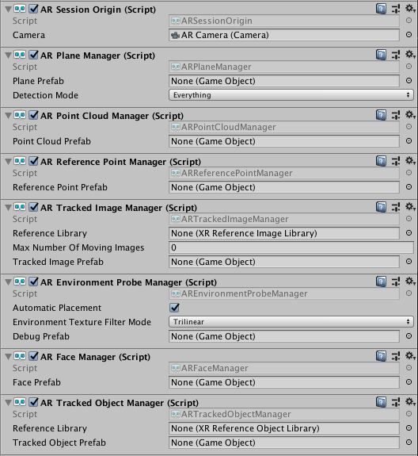

# Trackable managers

In AR Foundation, a "trackable" is anything that can be detected and tracked in the real world. Planes, point clouds, anchors, environment probes, faces, images, and 3D objects are all examples of trackables.

Each trackable has a trackable manager. All the trackable managers must be on the same `GameObject` as the AR Session Origin. This is because the session origin defines the transform to which all the detected trackables are relative. The trackable managers use the session origin to place the detected trackables in the correct place in the Unity scene graph.

This image shows the session origin with all the trackable managers:



This table summarizes the trackable managers and their trackables.

| **Trackable Manager** | **Trackable** | **Purpose** |
|-|-|-|
| [`ARPlaneManager`](plane-manager.md)                        | `ARPlane`            | Detects flat surfaces. |
| [`ARPointCloudManager`](point-cloud-manager.md)             | `ARPointCloud`       | Detects feature points. |
| [`ARAnchorManager`](anchor-manager.md)                      | `ARAnchor`           | Manages anchors. You can manually add and remove them with `ARAnchorManager.AddAnchor` and `ARAnchorManager.RemoveAnchor`. |
| [`ARRaycastManager`](raycast-manager.md)                    | `ARRaycast`          | Repeats and updates a raycast automatically. |
| [`ARTrackedImageManager`](tracked-image-manager.md)         | `ARTrackedImage`     | Detects and tracks 2D images. |
| [`AREnvironmentProbeManager`](environment-probe-manager.md) | `AREnvironmentProbe` | Creates cubemaps that represent the environment. |
| [`ARFaceManager`](face-manager.md)                          | `ARFace`             | Detects and tracks human faces. |
| [`ARTrackedObjectManager`](tracked-object-manager.md)       | `ARTrackedObject`    | Detects 3D objects. |
| [`ARParticipantManager`](participant-manager.md)            | `ARParticipant`      | Tracks other users in a multi-user collaborative session. |

Each trackable component stores information about the trackable, but doesn't visualize it. Its manager updates its `transform` whenever the AR device reports an update.

## Enabling and disabling features

Enabling a trackable manager enables that feature. For example, you can toggle plane detection by enabling or disabling the AR Plane Manager. Enabling a particular feature can cause the device to consume more power, so it's best to disable managers when your application isn't using them.

## Enumerating trackables

Trackables can be enumerated via their manager with the `trackables` member. For example:

```csharp
var planeManager = GetComponent<ARPlaneManager>();
foreach (ARPlane plane in planeManager.trackables)
{
    // Do something with the ARPlane
}
```

The `trackables` property returns a `TrackableCollection`, which can be enumerated in a `foreach` statement as in the above example. You can also query for a particular trackable with the `TryGetTrackable` method.

## Trackable lifetime

Each trackable can be added, updated, and removed. Each frame, the managers query for the set of changes to their trackables since the previous frame. Each manager has an event to which you can subscribe to be notified of these changes:

| **Trackable Manager** | **Event** |
|-|-|
| `ARPlaneManager`              | `planesChanged`|
| `ARPointCloudManager`         | `pointCloudsChanged`|
| `ARAnchorManager`             | `anchorsChanged`|
| `ARTrackedImageManager`       | `trackedImagesChanged`    |
| `AREnvironmentProbeManager`   | `environmentProbesChanged` |
| `ARFaceManager`               | `facesChanged` |
| `ARTrackedObjectManager`      | `trackedObjectsChanged` |
| `ARParticipantManager`        | `participantsChanged` |

A trackable will always be added before it is updated or removed. Likewise, a trackable can't be removed unless it was added first. Updates depend on the trackable's semantics and the provider-specific implementation.

### Adding and removing trackables

Some trackables, like anchors and environment probes, can be added and removed manually. Other trackables, like planes, are automatically detected and removed. Some trackables can be added manually or created automatically. Where supported, the relevant managers provide methods for addtion and removal.

You should never `Destroy` a trackable component or its `GameObject` directly. For trackables that support manual removal, their manager provides a method to remove it. For example, to remove an anchor, you need to call `RemoveAnchor` on the `ARAnchorManager`.

When you manually add a trackable, the underlying subsystem might not track it immediately. You won't get an added event for that trackable until the subsystem reports that it has been added (typically on the next frame). During the time between manual addition and the added event, the trackable will be in a "pending" state. You can check this with the `pending` property on every trackable.

For example, if you add an anchor, it will likely be pending until the next frame:

```csharp
var anchor = AnchorManager.AddAnchor(new Pose(position, rotation));
Debug.Log(anchor.pending); // "true"

// -- next frame --
void OnAnchorsChanged(ARAnchorsChangedEventArgs eventArgs)
{
    foreach (var anchor in eventArgs.added)
    {
        // anchor added above now appears in this list.
    }
}
```

The exact amount of time a trackable spends in the `pending` state depends on the underlying implementation.

When a trackable receives a removal notification, its manager `Destroy`s the trackable's `GameObject` unless `destroyOnRemoval` is false.


#### Deactivating existing trackables

Sometimes, you might want to stop performing behavior associated with a trackable without disabling its manager. For example, you might wish to stop rendering detected planes without stopping plane detection.

To do this, deactivate each trackable's `GameObject`:

```csharp
var planeManager = GetComponent<ARPlaneManager>();
foreach (var plane in planeManager.trackables)
{
    plane.gameObject.SetActive(false);
}
```

## Controlling a trackable's `GameObject`

When a new trackable is detected, its manager instantiates a prefab configurable on the manager. The instantiated `GameObject` must have an `ARTrackable` component for that type of trackable. If the prefab is `null`, the system creates a `GameObject` with only the relevant `ARTrackable`. If your prefab doesn't have the relevant `ARTrackable`, the system adds one.

For example, when the plane manager detects a plane, it creates a `GameObject` using the "Plane Prefab" if specified, or an empty `GameObject` otherwise, then ensures that the `GameObject` has an `ARPlane` component on it.
